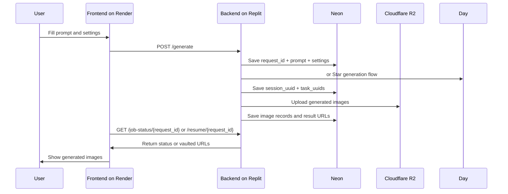

# Deployment And Hosting

This project uses two separate hosted pieces:

- **Backend:** Replit
- **Frontend:** Render

This document explains how they work together so a new AI agent can understand the deployment model quickly.

## Backend On Replit

The backend is the FastAPI server in this repo.

### What it does

- Accepts generation requests from the frontend
- Routes jobs to Day or Star
- Tracks job state with `request_id`
- Stores generation metadata in Neon
- Uploads final images to Cloudflare R2
- Returns vaulted image URLs to the frontend

### Main backend entrypoint

- [`main.py`](/Users/sema/Documents/code/work/testImgnai/main.py)

### Backend runtime responsibilities

- Read env vars such as:
  - `IMGNAI_USERNAME`
  - `IMGNAI_PASSWORD`
  - `DATABASE_URL`
  - `R2_ACCESS_KEY`
  - `R2_SECRET_KEY`
- Run on Replit
- Expose the API endpoints used by the frontend

## Frontend On Render

The frontend is a static page hosted on Render.

### What it does

- Lets the user choose Day or Star
- Lets the user choose model, quality, size, seed, and prompt
- Sends generation requests to the backend
- Polls the backend for job status
- Loads history from the backend
- Renders the R2 image URLs returned by the backend

### Main frontend file

- [`public/index.html`](/Users/sema/Documents/code/work/testImgnai/public/index.html)

## How They Work Together

1. The user opens the frontend on Render.
2. The frontend sends a `POST /generate` request to the Replit backend.
3. The backend creates a `request_id` and starts the job.
4. The backend logs into Day or Star, gets `session_uuid` and `task_uuids`, polls the task endpoints, and uploads images to R2.
5. The backend stores state and results in Neon.
6. The frontend polls `GET /job-status/{request_id}` or `GET /resume/{request_id}`.
7. When the job is done, the backend returns final R2 URLs.
8. The frontend displays the images directly from R2.

## Request Flow

## Important URLs

The frontend should point to the backend API base URL for:

- `POST /generate`
- `GET /job-status/{request_id}`
- `GET /resume/{request_id}`
- `GET /history`
- `GET /health`

## Important Behavior

- The frontend should send `realm`:
  - `day`
  - `star`
- The backend should route based on `realm`.
- `request_id` is the retry/resume token.
- `client_id` is only a front-end label.
- Images are served from R2, not from local backend files.

## What A New Agent Should Check First

1. Verify the backend is running on Replit.
2. Verify the frontend has the correct backend URL.
3. Confirm `realm` is being sent correctly.
4. Confirm `request_id` is stored by the frontend for retries.
5. Confirm the backend has Neon and R2 credentials configured.

## Common Mistakes

- Using `client_id` as a retry token
- Routing by `nsfw` instead of `realm`
- Expecting the backend to serve the final images from local disk
- Forgetting to update both frontend and backend when model catalogs change

